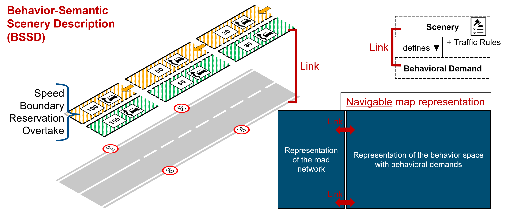

# Behavior-Semantic Scenery Description (BSSD)

Welcome to the documentation and overview repository for the Behavior-Semantic Scenery Description (BSSD). Here you will find all information about BSSD itself and an overview of the associated, available repositories.

The BSSD framework provides a comprehensive method to link behavioral demands directly to elements of a traffic environment, supporting the development, safety validation and operation of Automated Vehicles (AVs). The framework focuses on the explicit representation of behavior-relevant information extracted from the static traffic environment - the scenery - which is usually represented in some kind of map. BSSD has a generic structure that fits every map format, ensuring broad applicability and ease of integration.



<br>

Currently supported map formats with BSSD extension:
- [Lanelet2](https://github.com/fzi-forschungszentrum-informatik/Lanelet2)
- [OpenDRIVE](https://www.asam.net/standards/detail/opendrive/)

Find example maps with BSSD extension [here](/maps/).

## Documentation

Are you new to BSSD or would you just like to know more about the theory behind it, the detailed specification for different map formats or further information? Here you can find the complete [BSSD documentation](/doc/overview.md).

If you are already familiar with BSSD and want to get started right away, you can find code-specific documentation directly in the repositories linked below.

## Overview of Repositories

Here you can find all repositories to work with BSSD.

### Working with BSSD based on Lanelet2 maps

| **Name**                  | **Description**                                                                                                                                                                                                                                                                                                                                 | **Language**                                                                                                                                                                                                 | **Link**                                                                                                                                                                                                                 |
|---------------------------|-------------------------------------------------------------------------------------------------------------------------------------------------------------------------------------------------------------------------------------------------------------------------------------------------------------------------------------------------|--------------------------------------------------------------------------------------------------------------------------------------------------------------------------------------------------------------|--------------------------------------------------------------------------------------------------------------------------------------------------------------------------------------------------------------------------|
| **BSSD Core**             | Low level Python library for handling BSSD data within Lanelet2 maps. If you work with Python, this is your go-to library.                                                                                                                                                                                                                       | <a></a>                                                                                                                                 | [](https://gitlab.com/tuda-fzd/scenery-representations-and-maps/bssd-core) [](https://github.com/TUDa-FZD/BSSD-Core)  |
| **Lanelet2 BSSD Converter** | Tool for the automated generation of the BSSD extension based on Lanelet2 maps. Use this tool for the initial generation of the BSSD extension for Lanelet2 maps.                                                                                                                                                                             | <a></a>                                                                                                                                 | [](https://gitlab.com/tuda-fzd/scenery-representations-and-maps/lanelet2-bssd-converter) [](https://github.com/TUDa-FZD/Lanelet2-BSSD-Converter)  |
| **OSM Map Merger**        | Tool for handling (negative) IDs and merging different OSM maps (e.g. Lanelet2 maps). Very helpful if you have modeled several maps separately and now want to merge them into a single map.                                                                                                                                                    | <a></a>                                                                                                                                 | [](https://gitlab.com/tuda-fzd/scenery-representations-and-maps/osm-map-merger) [](https://github.com/TUDa-FZD/OSM-Map-Merger)  |
| **CapBasedRouting**       | Capability-based route planner for the identification of routes that AVs with certain driving capabilities can handle based on the driving requirements of the given environment. Use this repository not only to determine drivable routes for your AV, but also to derive driving requirements from your ODD.                                  | <a></a>                                                                                                                        | [](https://gitlab.com/tuda-fzd/scenery-representations-and-maps/capability-based-routing) [](https://github.com/TUDa-FZD/Capability-Based-Routing)  |

### Working with BSSD based on OpenDRIVE maps

| **Name**                  | **Description**                                                                                                                                                                                               | **Language**                                                                                                                                                                                        | **Link**                                                                                                                                                                                                                 |
|---------------------------|---------------------------------------------------------------------------------------------------------------------------------------------------------------------------------------------------------------|-----------------------------------------------------------------------------------------------------------------------------------------------------------------------------------------------------|--------------------------------------------------------------------------------------------------------------------------------------------------------------------------------------------------------------------------|
| **OpenDRIVE BSSD Converter** | Tool for the automated generation of the BSSD extension based on OpenDRIVE maps. Use this tool for the initial generation of the BSSD extension for OpenDRIVE maps.                                             | <a></a>                                                                                                                                 | [](https://gitlab.com/tuda-fzd/scenery-representations-and-maps/opendrive-bssd-converter) [](https://github.com/TUDa-FZD/OpenDRIVE-BSSD-Converter)  |

## Credits

M. Lippert, F. Glatzki, and H. Winner,
[“Behavior-Semantic Scenery Description (BSSD) of Road Networks for Automated Driving”](https://ieeexplore.ieee.org/document/10474379),
IEEE Access, Volume 12, 2024

If you find our work useful in your research, please consider citing:

```bibtex
@ARTICLE{lippert2024,
  author={Lippert, Moritz and Glatzki, Felix and Winner, Hermann},
  journal={IEEE Access}, 
  title={Behavior-Semantic Scenery Description (BSSD) of Road Networks for Automated Driving}, 
  year={2024},
  volume={12},
  number={},
  pages={43039-43052},
  doi={10.1109/ACCESS.2024.3379007}
}
```

This work was supported in part by the [Federal Ministry of Education and Research of Germany (BMBF)](https://www.bmbf.de/bmbf/en/) through the Project [UNICAR*agil*](https://www.unicaragil.de/en/) under Grant FKZ 16EMO0286, and in part by [Continental](https://www.continental-automotive.com/en.html) through the Project [PRORETA 5](https://www.proreta.tu-darmstadt.de/proreta/index.en.jsp).

| BMBF                                                                                                | UNICAR*agil*                                                                                                       | Continental | PRORETA 5                                                                                                                                                                                 |
|----------------------------------------------------------------------------------------------------------|----------------------------------------------------------------------------------------------------------------------| ---|--------------------------------------------------------------------------------------------------------------------------------------------------------------------------------------|
| <a href="https://www.bmbf.de/EN/"></a> | <a href="https://unicaragil.de/en/"></a> | <a href="https://www.continental-automotive.com/en.html"></a> | <a href="https://www.proreta.tu-darmstadt.de"></a> |

We want to particularly thank:
- **[Eric Krämer](https://github.com/erickraemer)** for his active support and contribution during the implementation of the BSSD extension for Lanelet2, BSSD Core, OSM Map Merger and CapBasedRouting
- **Jannik Hildebrand** for his active support and contribution during the implementation of the Lanelet2 BSSD Converter
- **Moritz Berghöfer** for his active support and contribution during the implementation of the BSSD extension for OpenDRIVE and OpenDRIVE BSSD Converter
