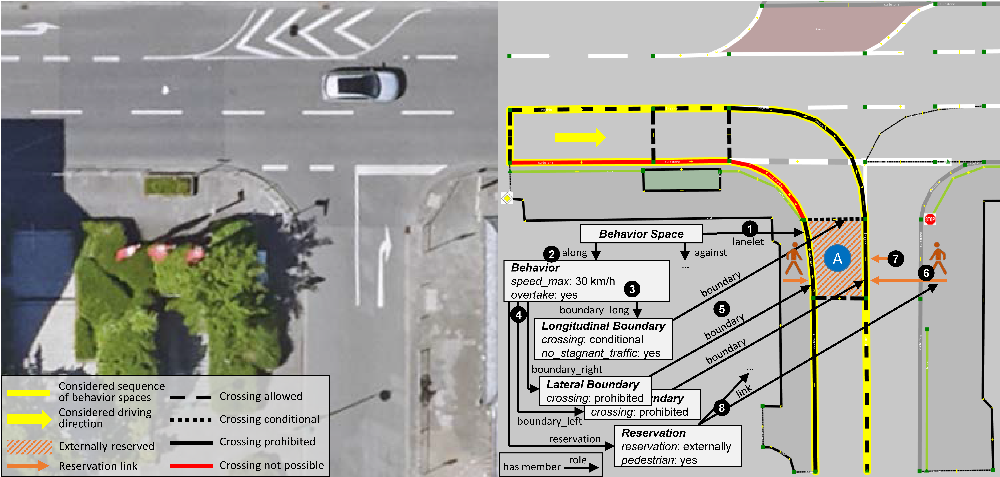
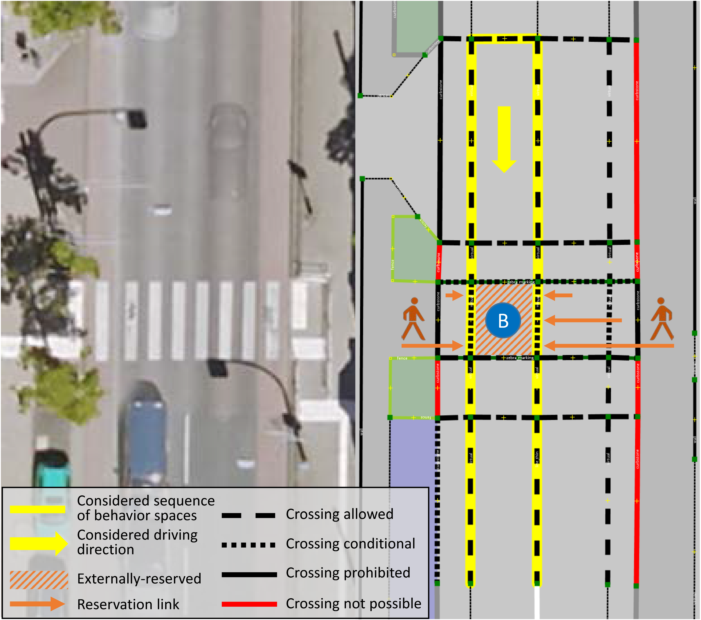

# Application Example

**Table of Contents**
- [Example A: T-Junction](#example-a-t-junction)
- [Example B: Crosswalk](#example-b-crosswalk)

___

Now, we give you examples in which the generic BSSD from the previous explanations is instantiated to describe real world sceneries. For this purpose, the BSSD is created using the map framework [Lanelet2](https://github.com/fzi-forschungszentrum-informatik/Lanelet2) as a basis. The characteristics of the Lanelet2 instance of BSSD is described [here](extension_lanelet2.md).

The two following real scenery sections in Darmstadt (Germany) were generated by first creating a Lanelet2 map based on high-precision satellite images. The corresponding BSSD information was then added in accordance with the generic structure. Both creation and visualization of the scenery sections were done entirely with [JOSM](https://josm.openstreetmap.de/) using the corresponding Lanelet2 map style. In addition, some of the BSSD information is visualized using a specific BSSD map style. Information boxes, arrows and pictograms were added manually to visually represent further information stored in the BSSD map implementation. The blue and black circles with respective numbering visually support the explanations in the following.

## Example A: T-Junction

The following figure shows the aerial image and the corresponding Lanelet2 map with the BSSD extension of example A. This example represents a T-junction within a 30 km/h speed zone. The priority road is a two lane one-way road and the secondary road is a two-lane road with bidirectional traffic. In order to explain the implemented structure, only one sequence of behavior spaces is considered (yellow marking), leaving the other behavior spaces unrepresented. Following the sequence in the marked direction (yellow arrow) is equivalent to a right turn maneuver. We consider the behavior space A (blue circle) for a detailed explanation of the BSSD information. It must be noted that pedestrians that potentially cross the secondary road during that right turn maneuver only can cross the road in the considered behavior space. A fence (light green line) prevents the crossing in the preceding behavior spaces. A crossing in the successive behavior space would no longer be part of the turn maneuver resulting in different behavioral demands. Of course, the global behavioral rules require that even collisions with pedestrians climbing over the fence are avoided. Again, at this point it should be noted that the focus of BSSD is on local behavioral rules that arise from specific sceneries.

Aerial image &copy; Orthophoto Vermessungsamt Darmstadt 2021

Behavior spaces are directly mapped to their corresponding lanelet (black circle 1), as the behavioral demands change before and after this lanelet. The lanelet is defined as a member with the role _lanelet_ of this _behavior space_, so that the scenery linkage is directly established. As further member, the behavior space has the relation _behavior_ with the role _along_ (black circle 2), which represents accordingly the behavior along the reference direction (the reference direction is defined by the lanelet). Besides the type of the relation, which is always defined, the behavioral demands of the attributes speed and overtake are directly stored within this relation (black circle 3). For behavior space A, the maximum allowed speed is 30 km/h and overtaking is not prohibited.

The behavioral demands of the remaining behavioral attributes boundary and reservation are modeled as relations. They are members of behavior with the respective role (_boundary\_long_, _boundary\_right_, _boundary\_left_ and _reservation_) as highlighted by the black circle 4. These elements in turn reference the Lanelet2 map information. For example, the boundaries are directly linked to the linestrings of the lanelets or the newly created linestrings for the longitudinal boundaries (black circle 5). Likewise, the linking of lanelets, from which road users with reservation claims may come, takes place. In this example, when entering the considered behavior space, priority must be given to pedestrians coming from the sidewalks to the left and right (black circle 6). That behavioral demand is a result of the turn maneuver since motor vehicles and bicycles generally have to give priority to pedestrians crossing the street while turning. Since crossing pedestrians might already be on the road in the lateral adjacent lanelet, this area has to be considered as a link as well (black circle 7). In general, all areas that have to be crossed by reservation entitled traffic participants must be considered and linked to the according reservation element. Thus, the reservation demand of the considered behavior space is _externally-reserved_ for pedestrians with a reservation _link_ to the corresponding Lanelet2 elements as highlighted by black circle 8 (sidewalks and adjacent lanelet, indicated by the orange arrows and pictograms). For clarity, only one of the three connections is explicitly shown in this example.

## Example B: Crosswalk

A second real scenery section is considered in example B in the following figure that shows a two-lane road with bidirectional traffic in a 50 km/h speed zone, lateral adjacent bicycle protection lanes and a crosswalk. A parking area adjacent to one bicycle protection lane is found as well (blue colored area in the Lanelet2 map). In this example, the behavioral demands regarding the boundary elements of the behavior spaces are visualized considering a driving direction as indicated by the yellow arrow. We again consider a certain sequence of behavior spaces (yellow marking) and, in particular, the behavior space B representing a lane section on the crosswalk. Because of the crosswalk the longitudinal boundary of B is _conditional_, as entering the crosswalk is not allowed when there is stagnant traffic. The lateral boundaries are _conditional_ for the same reason. In case only one lane is blocked by stagnant traffic, it shall not be allowed to move over another lane into the blocked lane by crossing the lateral boundary. Since priority must be given to crossing pedestrians, the reservation type is _externally-reserved_. The arrows in the figure show the respective links from where pedestrians may come. Finally, overtaking is not allowed at pedestrian crossings, and thus, the overtake attribute is set to _permission: no_.

Aerial image &copy; Orthophoto Vermessungsamt Darmstadt 2021

 

----

**Continue with the next chapter [BSSD Extension for Lanelet2](extension_lanelet2.md) or go back to the [overview page](overview.md).**