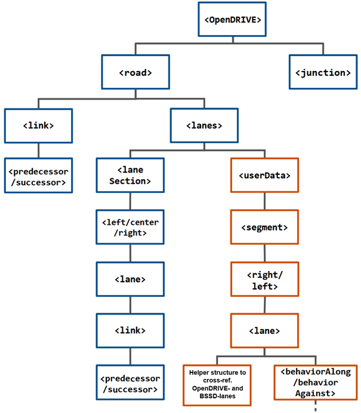
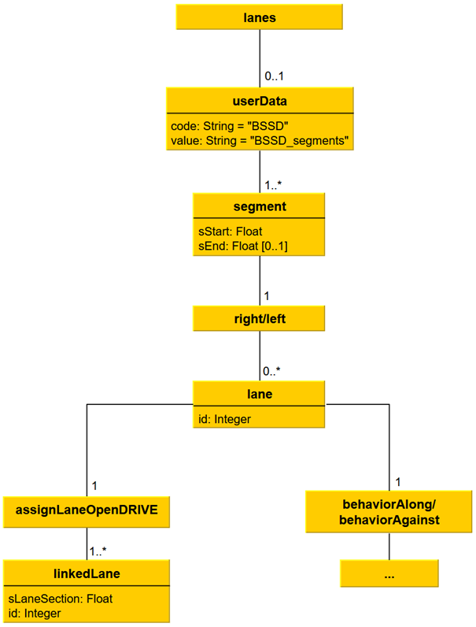
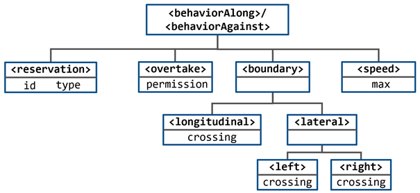

# BSSD Extension for OpenDRIVE

**Table of Contents**
- [Integration in the OpenDRIVE Data Structure](extension_OpenDRIVE.md#integration-in-the-opendrive-data-structure)
- [Data Structure](extension_OpenDRIVE.md#data-structure)
- [Map Format Code Example](extension_OpenDRIVE.md#map-format-code-example)

___

This section gives few information about the design of the BSSD extension for OpenDRIVE. To understand the BSSD extension it is absolutely necessary that you are familiar with the [OpenDRIVE](https://www.asam.net/standards/detail/opendrive/) map format.

For detailed information about the BSSD extension for OpenDRIVE check out this work of M. Berghöfer: [Entwicklung eines Konzepts zur Integration der verhaltenssemantischen Szeneriebeschreibung in hochgenaue Karten (engl.: _Development of a Concept for the Integration of the Behavior-Semantic Scenery Description into High Definition Maps_)](https://tuprints.ulb.tu-darmstadt.de/22887/1/Berghoefer_Konzept_Integration_BSSD_OpenDRIVE.pdf)
> **Attention** German language only, feel free to use DeepL etc. for translation

## Integration in the OpenDRIVE data structure

The following figure shows the overall structure of the BSSD integration in OpenDRIVE.

 

<br>

All elements resulting from the BSSD integration are shown in orange and conventional OpenDRIVE elemens are shown in blue. The `<userData>` element, which enables user-defined data to be inserted, is inserted into a road on the OpenDRIVE map below the `<lanes>` element, which exists exactly once for each road. Any number of BSSD segments are subordinated to the `<userData>` element, each of which is represented by a `<segment>` element. According to the specification of the BSSD, a BSSD segment has the subordinate elements `<right>` and `<left>`, which are used to group the BSSD `<lane>` elements. The latter contain the subordinate elements `<behaviorAlong>` and `<behaviorAgainst>`, which each contain the atomic behavior space valid in the BSSD `<lane>` element. On the other hand, it is necessary for each BSSD `<lane>` element to have a subordinate auxiliary structure that enables a unique assignment of this BSSD `<lane>` element to an OpenDRIVE `<lane>` element for each 𝑠-coordinate at which the higher-level BSSD segment is defined. An auxiliary structure is defined as part of the concept detailing described in this section. The BSSD-`<lane>` elements preceding and following a BSSD-`<lane>` element are implicitly defined via the `<predecessor>` or `<successor>` elements of the OpenDRIVE-`<lane>` element, which is linked to the auxiliary structure for this BSSD-`<lane>` element.

The following UML-Diagram gives additional information about the different elements.



## Data structure

The following figure shows the minimal BSSD data structure that is necessary for extending OpenDRIVE maps with BSSD data.



## Map Format Code Example

Within an OpenDRIVE XML file the code will look like this:
```xml
<userData code="BSSD" value="BSSD_segments">
	<segment sStart="2.1213323070000001e+03">
		<right>
			<lane id="-4">
				<assignLaneOpenDRIVE>
					<linkedLane sLaneSection="2.1213323070000001e+03" id="-4"/>
				</assignLaneOpenDRIVE>
				<behaviorAlong>
					<boundary>
						<longitudinal crossing=""/>
						<lateral>
							<left crossing=""/>
							<right crossing=""/>
						</lateral>
					</boundary>
					<reservation id="" type=""/>
					<overtake permission=""/>
					<speed max=""/>
				</behaviorAlong>
				<behaviorAgainst>
					<boundary>
						<longitudinal crossing=""/>
						<lateral>
							<left crossing=""/>
							<right crossing=""/>
						</lateral>
					</boundary>
					<reservation id="" type=""/>
					<overtake permission=""/>
					<speed max=""/>
				</behaviorAgainst>
			</lane>
			<lane id="-3">
				<assignLaneOpenDRIVE>
					<linkedLane sLaneSection="2.1213323070000001e+03" id="-3"/>
				</assignLaneOpenDRIVE>
				<behaviorAlong>
					<boundary>
						<longitudinal crossing=""/>
						<lateral>
							<left crossing=""/>
							<right crossing=""/>
						</lateral>
					</boundary>
					<reservation id="" type=""/>
					<overtake permission=""/>
					<speed max="2.5000000000000000e+02"/>
				</behaviorAlong>
				<behaviorAgainst>
					<boundary>
						<longitudinal crossing=""/>
						<lateral>
							<left crossing=""/>
							<right crossing=""/>
						</lateral>
					</boundary>
					<reservation id="" type=""/>
					<overtake permission=""/>
					<speed max=""/>
				</behaviorAgainst>
			</lane>
			<lane id="-2">
				<assignLaneOpenDRIVE>
					<linkedLane sLaneSection="2.1213323070000001e+03" id="-2"/>
				</assignLaneOpenDRIVE>
				<behaviorAlong>
					<boundary>
						<longitudinal crossing=""/>
						<lateral>
							<left crossing=""/>
							<right crossing=""/>
						</lateral>
					</boundary>
					<reservation id="" type=""/>
					<overtake permission=""/>
					<speed max="2.5000000000000000e+02"/>
				</behaviorAlong>
				<behaviorAgainst>
					<boundary>
						<longitudinal crossing=""/>
						<lateral>
							<left crossing=""/>
							<right crossing=""/>
						</lateral>
					</boundary>
					<reservation id="" type=""/>
					<overtake permission=""/>
					<speed max=""/>
				</behaviorAgainst>
			</lane>
			<lane id="-1">
				<assignLaneOpenDRIVE>
					<linkedLane sLaneSection="2.1213323070000001e+03" id="-1"/>
				</assignLaneOpenDRIVE>
				<behaviorAlong>
					<boundary>
						<longitudinal crossing=""/>
						<lateral>
							<left crossing=""/>
							<right crossing=""/>
						</lateral>
					</boundary>
					<reservation id="" type=""/>
					<overtake permission=""/>
					<speed max="2.5000000000000000e+02"/>
				</behaviorAlong>
				<behaviorAgainst>
					<boundary>
						<longitudinal crossing=""/>
						<lateral>
							<left crossing=""/>
							<right crossing=""/>
						</lateral>
					</boundary>
					<reservation id="" type=""/>
					<overtake permission=""/>
					<speed max=""/>
				</behaviorAgainst>
			</lane>
		</right>
		<left>
			<lane id="1">
				<assignLaneOpenDRIVE>
					<linkedLane sLaneSection="2.1213323070000001e+03" id="1"/>
				</assignLaneOpenDRIVE>
				<behaviorAlong>
					<boundary>
						<longitudinal crossing=""/>
						<lateral>
							<left crossing=""/>
							<right crossing=""/>
						</lateral>
					</boundary>
					<reservation id="" type=""/>
					<overtake permission=""/>
					<speed max="2.5000000000000000e+02"/>
				</behaviorAlong>
				<behaviorAgainst>
					<boundary>
						<longitudinal crossing=""/>
						<lateral>
							<left crossing=""/>
							<right crossing=""/>
						</lateral>
					</boundary>
					<reservation id="" type=""/>
					<overtake permission=""/>
					<speed max=""/>
				</behaviorAgainst>
			</lane>
		</left>
	</segment>
</userData>
```

<br>

----

**Go back to the [overview page](overview.md).**