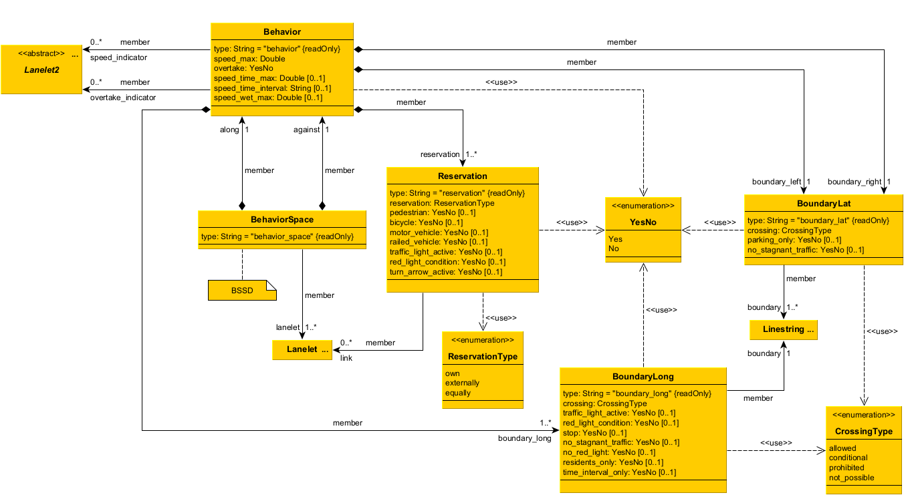

# BSSD Extension for Lanelet2

**Table of Contents**
- [Why Lanelets Can Be Used as a Basis for Behavior Spaces](#why-lanelets-can-be-used-as-a-basis-for-behavior-spaces)
- [Data Structure](#data-structure)
- [Linkage of BSSD Objects to Scenery Elements](#linkage-of-bssd-objects-to-scenery-elements)
- [Map Format Code Example](#map-format-code-example)

___

This section describes the design of the BSSD extension for Lanelet2 in detail. Before diving in, ensure you have a basic understanding of the BSSD concept and Lanelet2.

Lanelet2 builds on the map format [OpenStreetMap (OSM)](https://wiki.openstreetmap.org/), which uses the elements _node_, _way_ and _relation_ in order to model a map (these nodes and ways are different to the defined ones explained [here](map_representation.md#elements-for-the-road-network-representation)). Ways consist of nodes and correspond to _linestrings_ in Lanelet2. Relations refer to _members_ like linestrings, nodes or relations and assign a _role_. The role defines the property or relationship of the member with respect to the relation.

Lanelet2 maps are augmented with BSSD information for the application of BSSD, while fully preserving the functionality of the original Lanelet2 map. The core element of the Lanelet2 map format are _lanelets_, which are used as atomic components of road networks to build maps. They are modeled as relations and always reference two lateral boundaries in the form of linestrings with the roles _left_ and _right_, within which directed movements take place and traffic rules do not change. Thus, for a motor vehicle, lanelets generally represent a lane section of a roadway. The representation of bicycle lanes or crosswalks as well as non-regular motion space is additionally possible.

## Why Lanelets Can Be Used as a Basis for Behavior Spaces

Behavior spaces are the primary objects in the BSSD framework. The Lanelet2 extension links these spaces to explicit parts of the road using the available lanelets. This approach is taken because lanelets and behavior spaces share several similarities:

- **Atomic Property**: 
  Lanelets describe an atomic part of the road network concerning traffic rules. Traffic rules remain constant within a lanelet, and relations to neighboring lanelets are consistent over the entire length of the lanelet, leading to consistent segmentations across the road's width. Similarly, behavior spaces describe an atomic part of the road network but concerning behavioral rules.

- **Geometric Description**:
  Lanelets are defined by their left and right boundaries, while behavior spaces require longitudinal boundaries as well. The three boundaries of behavior spaces (one longitudinal entry and two lateral exit boundaries) form an enclosed space, with the longitudinal boundary connecting the lateral boundaries. When describing a longitudinal segment of a lane, the lateral boundaries for a lanelet and a behavior space can be the same if certain conditions are met. The longitudinal boundary of the behavior space is an additional information compared to a lanelet. Areas of the lanelet and the behavior space usually mainly overlap, but there are exceptions.

- **Lateral Extent**:
  Both lanelets and behavior spaces cover the width of a single lane. There is no known case where traffic or behavior rules change laterally over the width of a single lane.

Therefore, the construction of a lane network for the BSSD is not necessary when using Lanelet2, since the map already provides the necessary information. Nevertheless, it must be ensured that the assignment of behavior spaces, as shown in the [generic structure](map_representation.md), to this road network is possible. Usually, the behavior space is assigned directly to a single lanelet. With respect to the generic structure, the lanelet therefore corresponds to the _lane_ element of the road network representation. In case two different behavior spaces have to be assigned to a single lanelet (e.g. because the behavioral demand changes within this lanelet), this lanelet can be split considering the design rules of Lanelet2. If the Lanelet2 map is to remain untouched, a lanelet can be artificially split using additional BSSD boundary elements in OSM format. If an behavior space contains two or more lanelets, they are referenced together without changing the format itself (e.g. a solid lane changes to a curbstone which requires a new lanelet but still has the boundary behavioral demand "not_allowed" and thus does not require a new behavior space). The union of multiple lanelets would break the Lanelet2 format and make it unusable at this point. To represent the behavioral demands of the longitudinal boundary, most lanelets also require additional linestrings. However, these can be added in a Lanelet2-compliant way without endangering the format. If such linestrings are already available, e.g. in the form of stop lines at the correct position, no new elements have to be created.

## Data Structure

The BSSD behavioral attributes are divided into four categories: speed, overtake, boundary, and reservation. These attributes are incorporated into the Lanelet2 extension. The class structure resembles the [generic behavior space representation](map_representation.md#elements-for-the-behavior-space-representation) with two key differences:
- Speed and overtake attributes are integrated directly into the behavior class.
- There is no explicit boundary object. Instead, there are separate lateral and longitudinal boundary objects.

Below is the UML class diagram of the BSSD extension for Lanelet2.



Find more UML class diagrams about the inheritance of the different classes [here](images/UML_inheritance.png) and about the OSM classes [here](images/UML_OSM_classes.png).

### Classes in the BSSD Extension for Lanelet2
- **BehaviorSpace**
- **Behavior** (along or against reference direction)
- **BoundaryLong**
- **BoundaryLat** (left or right)
- **Reservation**

All these classes are specific relations of the OSM basic data structures. Each instance of these classes requires a unique ID across the entire Lanelet2 map.

## Linkage of BSSD Objects to Scenery Elements

A crucial feature of the BSSD concept is the linkage of behavior spaces to elements of the scenery. This includes:
- Linking a behavior space to one or more lanelets.
- Linking to areas where traffic participants with right of way crossing the ego vehicle's path might come from.
- Linking to traffic signs indicating behavioral changes, such as speed or overtake indicators.

As shown in the class diagram, these linkages are also considered in the BSSD extension for Lanelet2. The objects that need linking include:
- **Lanelets:** geometric representation of the behavior space and reservation objects
- **Linestrings:** specific geometric representation in boundary or reservation objects
- **Traffic signs:** behavior rule indicators (this is optional)

These links are modeled using the member attributes of relations.

## Map Format Code Example

According to this [Application Example](application_example.md#example-a-t-junction) you'll find the map data of the behavior space A in XML format in the following.

First, we need a **behavior space** with behaviors in both directions and a linked lanelet:
```
<relation id='180799' action='modify' visible='true' version='1'>
  <member type='relation' ref='100103' role='lanelet' />
  <member type='relation' ref='180793' role='along' />
  <member type='relation' ref='180798' role='against' />
  <tag k='type' v='behavior_space' />
</relation>
```
The **behavior along the reference direction** of the lanelet is defined as follows. As you can see, the **speed and overtake attributes** are specified directly within this element:
```
<relation id='180793' visible='true' version='1'>
  <member type='relation' ref='180789' role='reservation' />
  <member type='relation' ref='180790' role='boundary_long' />
  <member type='relation' ref='180791' role='boundary_left' />
  <member type='relation' ref='180792' role='boundary_right' />
  <tag k='overtake' v='yes' />
  <tag k='speed_max' v='30' />
  <tag k='type' v='behavior' />
</relation>
```
**Longitudinal boundary** that references a way (linestring):
```
<relation id='180790' visible='true' version='1'>
  <member type='way' ref='101964' role='boundary' />
  <tag k='crossing' v='conditional' />
  <tag k='no_stagnant_traffic' v='yes' />
  <tag k='type' v='boundary_long' />
</relation>
```
The **referenced way** was added on top of the existing Lanelet2 map information. You can see this from the fact that the way is tagged as type "BSSD":
```
<way id='101964' visible='true' version='1'>
  <nd ref='111023' />
  <nd ref='110974' />
  <tag k='subtype' v='boundary' />
  <tag k='type' v='BSSD' />
</way>
```
Here comes the **left lateral boundary**:
```
<relation id='180791' visible='true' version='1'>
  <member type='way' ref='103059' role='boundary' />
  <tag k='crossing' v='prohibited' />
  <tag k='type' v='boundary_lat' />
</relation>
```
And the **right lateral boundary**:
```
<relation id='180792' visible='true' version='1'>
  <member type='way' ref='103055' role='boundary' />
  <tag k='crossing' v='prohibited' />
  <tag k='type' v='boundary_lat' />
</relation>
```
Finally, the **reservation** is specified as follows:
```
<relation id='180789' visible='true' version='1'>
  <member type='relation' ref='100054' role='link' />
  <member type='relation' ref='100109' role='link' />
  <member type='relation' ref='100055' role='link' />
  <tag k='pedestrian' v='yes' />
  <tag k='reservation' v='externally' />
  <tag k='type' v='reservation' />
</relation>
```
Note the three different **links of the reservation** to define where reservation-entitled road users may come from. E.g. from the adjacent lane section which is a lanelet:
```
<relation id='100109' visible='true' version='1'>
  <member type='way' ref='103059' role='left' />
  <member type='way' ref='103056' role='right' />
  <tag k='location' v='urban' />
  <tag k='one_way' v='yes' />
  <tag k='region' v='de' />
  <tag k='subtype' v='road' />
  <tag k='type' v='lanelet' />
</relation>
```
Or from the area of a walkway:
```
<relation id='100054' visible='true' version='1'>
  <member type='way' ref='103041' role='outer' />
  <member type='way' ref='103700' role='outer' />
  <member type='way' ref='103029' role='outer' />
  <member type='way' ref='103056' role='outer' />
  <member type='way' ref='103062' role='outer' />
  <member type='way' ref='102847' role='outer' />
  <member type='way' ref='103042' role='outer' />
  <member type='way' ref='102855' role='outer' />
  <tag k='location' v='urban' />
  <tag k='subtype' v='walkway' />
  <tag k='type' v='multipolygon' />
</relation>
```

<br>

----

**Continue with the next chapter [BSSD Extension for OpenDRIVE](extension_OpenDRIVE.md) or go back to the [overview page](overview.md).**