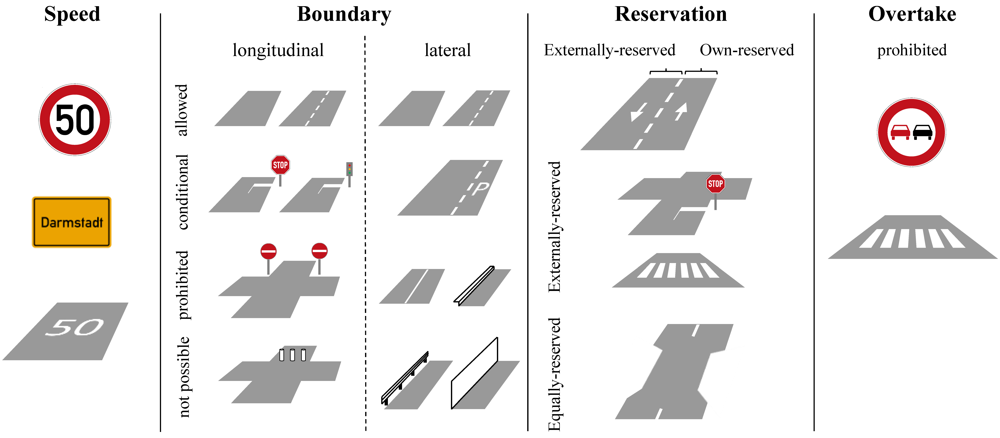
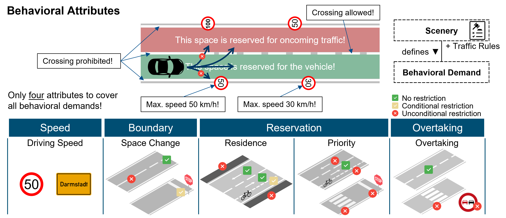
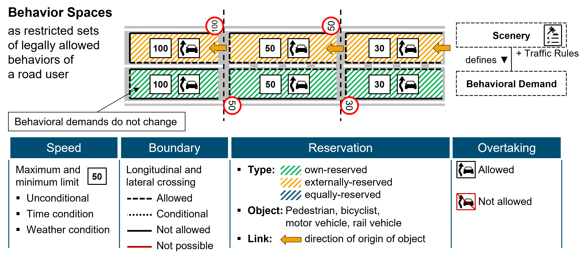

# Introducing Behavioral Demand, Behavior Space and Behavioral Attributes

**Table of Contents**
- [Behavioral Demand](#behavioral-demand)
- [Behavior Space](#behavior-space)
- [Behavioral Attributes](#behavioral-attributes)
- [Visual Summary](#visual-summary)

___

## Behavioral Demand

To ensure safe operation during a trip of an AV in compliance with traffic regulations, the applicable traffic regulations must be observed and complied with at all times. However, traffic rules alone are not sufficient to make a statement about specific rules of behavior within a scenery - the static traffic environment - specified in the ODD. The traffic rules are closely linked to the elements of the scenery, so that only a combination of scenery and traffic rules can provide information about required behavior in road traffic. Given traffic rules in a country, the scenery consequently defines the rules of behavior in the public traffic area. We define these scenery-based behavioral rules even more specifically as behavioral demand:

> **Behavioral demand** describes the restriction of the legally allowed behavior of a traffic participant without specifying an explicit behavior.

The scenery elements play a crucial role in the derivation of the behavioral demands, since they indicate the applicable rules. For this reason, we define these scenery elements as indication elements:

> **Indication elements** are elements of the scenery that define and indicate the behavioral demands considering the applicable road traffic regulations. It is possible that different scenery elements or different combinations of scenery elements result in the same behavioral demands.

## Behavior Space

Behavioral demands are always bound to spaces or to changes between these spaces (e.g. traffic lanes) in road traffic. It is therefore reasonable to use these spaces to represent behavioral demands. For this reason, the term behavior space is introduced:

> **Behavior space** represents the restricted set of legally allowed behaviors of a traffic participant. The following applies:
> 1.  The behavior space is spanned by behavioral attributes that define all applicable behavioral demands of the behavior space.
> 2.  The behavior space defines only the legal behavioral limits of a traffic participant, so that no explicit behavior is imposed on a traffic participant.
> 3.  The behavioral demands of the behavioral attributes within a behavior space do not change.
> 4.  Behavior spaces may differ for different types of traffic participants.

## Behavioral Attributes

There are four behavioral attributes that span the behavior spaces: _speed_, _boundary_, _reservation_ and _overtake_.

### Speed

This behavioral attribute includes all behavioral demands regarding restrictions on driving speed. Town signs as well as explicit speed signs are indication elements that cause these restrictions. Speed signs can be equipped with additional signs, so that the speed restrictions are provided with conditions. These conditional restrictions are also captured in the speed attribute. They include, for example, time-of-day restrictions, but also weather-dependent restrictions.

### Boundary

This behavioral attribute represents the boundaries of the behavior space. Crossing the behavioral space boundaries is assigned with restrictions of the area changes and with restrictions of the residence. Crossing the boundaries can thus be _allowed_, _conditional_, _prohibited_, or _not possible_. Since the behavior space of a motor vehicle typically represents a longitudinal section of a lane, the boundary attribute is differentiated into longitudinal and lateral boundaries.

Crossing the longitudinal boundary is allowed without indication elements present. As soon as indication elements are present, however, restrictions may arise. A stop sign with associated stop line requires a crossing condition: The vehicle must stop before it is allowed to proceed. If a traffic signal with associated stop line is present, the stop line may not be crossed if the traffic signal shows red. Furthermore, it is not permitted to drive into intersections or crosswalks if there is traffic congestion and it is therefore not possible to drive through the areas. Crossing in these cases is therefore _conditional_. Entering a one-way street against the direction of travel is not permitted. Similarly, there are lanes that are designated only for certain types of traffic. All spaces into which a motor vehicle is not allowed to enter are accordingly marked with a longitudinal boundary _prohibited_. In some cases, longitudinal entry into a behavior space may even be not possible, i.e., the vehicle is physically prevented from entering. An example of this would be a lane that ends for motor vehicles but allows bicyclists to continue. The two spaces may be separated by bollards or similar physical barriers, allowing only bicyclists to pass. In these cases, crossing the longitudinal boundary is _not possible_.

Lateral boundaries have in principle the same properties as longitudinal boundaries. Here, as well, the crossing is differentiated into _allowed_, _conditional_, _prohibited_ and _not possible_. The lateral boundaries of behavior spaces typically correspond to the lane boundaries on roadways. No or dashed lane markings signal as an indication element that crossing the lateral boundary is _allowed_. Parking lanes require that entry is only allowed for the purpose of parking, so the associated lateral boundary is assigned _conditional_ accordingly. Solid lane markings or curbs may not be crossed and are modeled accordingly as lateral boundaries with the value _prohibited_. Especially high curbs, guard rails, fences or walls are physically not traversable for a motor vehicle. These indication elements therefore result in lateral boundaries where driving over them is _not possible_.

### Reservation

In this attribute mainly the restrictions of the priority are covered. A reservation type is always defined. Behavior spaces in which the ego-vehicle itself has priority are called _own-reserved_. No other constraints exist for own-reserved behavior spaces. An example is driving in a lane which is reserved for the driven direction and for which there are no further indication elements regarding priority. Behavior spaces in which the ego-vehicle must give priority to other traffic participants are called _externally-reserved_. In the case of externally-reserved, the traffic participant type and potential direction of origin of the traffic participants entitled to reservation are also specified. In section "identification of demand" different traffic participant types were introduced. Regarding priority rules, the numerous types can be reduced to four classes, since priority rules are imposed only for these: motor vehicle, bicycle, pedestrian and rail vehicle. For example, passenger cars, motorcycles, trucks or even buses are included in the motor vehicle class in terms of priority. With these traffic participant classes and the direction of origin, externally-reserved behavior spaces are fully defined. In the case of a crosswalk, it would consequently be explicitly known that this behavior space is reserved for pedestrians already in this area or approaching it from the right or left. Thus, the priority case is unambiguous and explicitly represented. Behavior spaces can furthermore be _equally-reserved_, addressing the case of unregulated priority. Since, as in the externally-reserved case, explicit interaction with other traffic participant types from certain directions of origin is addressed, these properties are also stored in the attribute. Thus, in the example of a lane narrowing, it would be explicitly specified with which traffic participants from which direction the ego-vehicle has to coordinate.

In addition, the reservation attribute is suitable for representing the conditional residence restrictions, since these are directly related to the priority regulation. If the ego-vehicle has to give priority to other traffic participants in a behavior space, it may additionally not permanently occupy this space. Therefore, the reservation type externally-reserved simultaneously addresses the necessity to leave the corresponding area as soon as possible. An example of this is the oncoming traffic lane or also a bicycle protection lane, both of which may only be used temporarily and not permanently.

### Overtake

All behavioral demands regarding restrictions of overtaking are stored in this attribute. Overtaking is either _permitted_ or _prohibited_. Typically, an overtaking prohibition is caused by a corresponding traffic sign. Another indication element for an overtaking prohibition is, for example, a crosswalk.

The following figure presents some indication elements that cause the defined behavioral attributes.

## Visual Summary

<kbd></kbd>
  
<kbd></kbd>

 

----

**Continue with the next chapter [Map Representation for BSSD](map_representation.md) or go back to the [overview page](overview.md).**