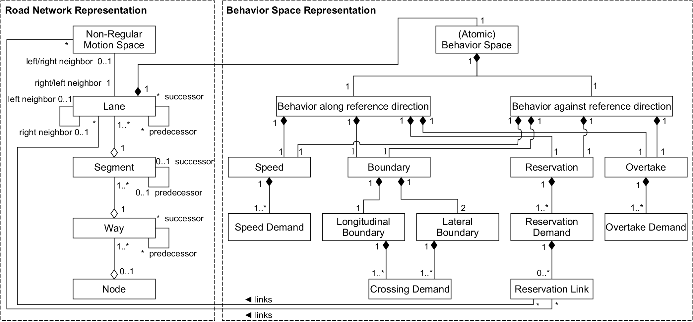
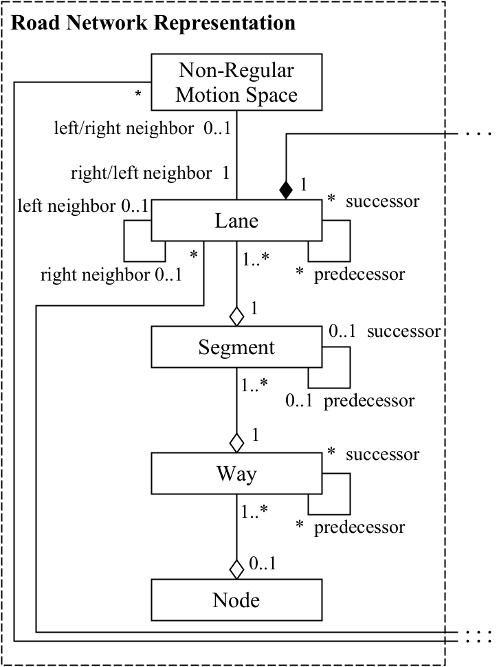
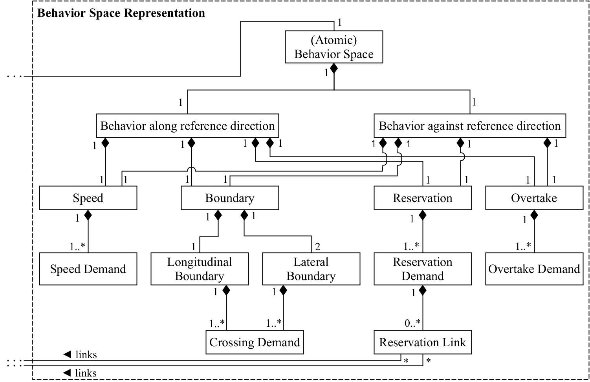

# Map Representation for BSSD

**Table of Contents**
- [Elements for the Road Network Representation](#elements-for-the-road-network-representation)
- [Elements for the Behavior Space Representation](#elements-for-the-behavior-space-representation)

___

This is the generic structure of BSSD. With this structure it is possible to create a BSSD extension for almost every map format.

## Elements for the Road Network Representation

The basis for a BSSD is a (partial) route network that is decomposed according to behavior spaces. In lateral extension, a lane represents the smallest possible road space onto which an behavior space is represented. For this purpose, it must necessarily be possible to represent individual lanes. Lanes are the central elements of the road network representation onto which the behavior spaces are mapped as the composition relation between the two representations in the figure above shows. In addition to a conventional lane for motor vehicles, a bicycle lane, for example, may also represent a lane. Such a lane is potentially used by a motor vehicle as well. Besides lanes within the regular motion space, elements of non-regular motion space have to be considered for the representation of reservation links (e.g. pedestrians coming from a sidewalk onto a pedestrian crossing).

Depending on the use case and ODD size, it may not be sufficient to represent individual behavior spaces in isolation. They must be considered in the overall context of a road network to ensure connectivity. In terms of navigability, all possible driving options such as turning or driving straight ahead at intersections or junctions as they exist in reality must therefore be represented. Thus, for every point in the road network where multiple driving options follow, the available behavior spaces must be represented as well. Since geometry is not a part of the description of a behavior space, the BSSD in its plain form does not require any geometry for the representation of sceneries. In this case, further auxiliary elements besides lanes are necessary for a consistent route network representation. If the BSSD is integrated into a map containing geometric information, some of these auxiliary elements may be omitted, depending on the level of detail of the map. For example, the relationship of individual lane sections in a highly accurate map would be evident based on geometric adjacency alone, without the need to define further dependencies. Without geometry, on the other hand, further information is required that defines these dependencies between lane sections (e.g. _lane section 1 is the left neighbor of lane section 2_ or similar information). Since a representation entirely without geometry requires the most auxiliary elements, this case is considered below. If geometric information is added, the corresponding auxiliary elements can simply be neglected. If they are beneficial for the application, however, it is still possible to use them.

Route networks can be described without geometry by a logically constructed topology following the topological graph theory. A road network is represented, as is common in navigation, using nodes and edges. The _nodes_ represent traffic points where the traffic flow branches in different directions. In the scenery, these points correspond to intersections, traffic circles or junctions, for example. All connecting roads between the nodes are modeled as edges, which are called _ways_ in the following. Consequently, more than two ways are connected at nodes. Within nodes, again ways represent the possible connections between the incoming and outgoing ways adjacent to the nodes. Each way in a road network therefore may have arbitrarily many predecessors or successors. This ambiguity of nodes is explicitly desired, because in this way the different driving options at nodes are represented. However, for a lane-accurate representation of the scenery, the ways must be further subdivided into _lanes_. As soon as different lane topologies prevail within a way (e.g. transition to a different number of lanes), a subdivision of the lanes in longitudinal direction becomes necessary.

For lateral transitions between lanes (e.g. lane changes) the neighbors of a lane are specified. In order to ensure uniqueness in lateral transitions every lane has only one left and right neighbor at most. This results in a longitudinal segmentation of a way into a _segment_ whenever any lane has a change in its behavior space. In order to enable the linkage of reservation receiving traffic participants lanes may have _non-regular motion space_ as a left or right neighbor. In contrast to lateral neighbors, a lane may have any number of predecessors or successors in longitudinal direction. As with ways at nodes, this property allows the assignment of multiple driving options for diverging or separating lanes and the associated behavior spaces.

An advantage of segmentation is the holistic representation of behavioral demands within a road segment. A segment represents the behavior space across the entire lane width. In this way, all behavioral demands for driving on the road section are explicitly available. The same principle applies to a way, which in turn consists of at least one segment.

In summary, depending on the integration of geometric information, the elements listed in the following table are necessary for mapping the BSSD to a road network.

| **Term**                   | **Description**                                                                                  |
|----------------------------|--------------------------------------------------------------------------------------------------|
| Node                       | Area in which multiple ways interfere and incoming and outgoing ways are connected.              |
| Way                        | Connecting road between and within nodes.                                                       |
| Segment                    | Section of a way in which the mapped behavior space is constant in longitudinal direction.       |
| Lane                       | Section of a segment in which the mapped behavior space is constant (no change at all).          |
| Non-regular motion space   | Space outside the regular motion space that shall never be used by motor vehicles.               |

The resulting structure of the road network representation within the BSSD is shown individually in the following figure.

## Elements for the Behavior Space Representation

Now we need a structure for mapping the behavioral demands onto the behavior spaces.

Due to the directionality of the behavioral demands, the behavior space must always be able to represent both possible driving directions of an AV. Therefore, an _behavior space_ always consists of two additional elements, the _behavior along reference direction_ and the _behavior against reference direction_ (the reference direction may be selected as desired). Both directions must cover the same knowledge requirements about the possible behavioral demands: _What is the speed limit? What conditions apply when changing lanes or entering a new space? Which traffic participants must be given priority? Is overtaking allowed?_

As a result, for both considered driving directions, the behavioral attributes _speed_, _boundary_, _reservation_ and _overtake_ are each assigned exactly once. In turn, the behavioral attributes always belong to only one considered driving direction within a behavior space. The behavioral demands describe the characteristic of the individual behavioral attributes. They are stored as a part of the respective attribute.

**_Speed Attribute:_** At least one _speed demand_ element must be defined, specifying the maximum allowed driving speed within the behavior space. Additional demand elements may be defined for speed limits under certain conditions such as time of day or weather. A required minimum speed may be added as well.

**_Boundary Attribute:_** The behavioral demands are restricted to crossing conditions of the respective boundaries. An behavior space always consists of one _longitudinal (entry) boundary_ and two _lateral (exit) boundaries_. At least one or more _crossing demand_ elements are assigned to each of the three boundaries. Conversely, each crossing demand element is part of a boundary element. An example for a double assignment of a longitudinal boundary is a stop line at a traffic light. In this case, different crossing demands apply for active or inactive traffic lights.

**_Reservation Attribute:_** The reservation attribute covers all behavioral demands regarding priority and residence allowance rules. By abstracting the description of these demands, it is possible to apply the representation to all behavior spaces independent of the type of road section (e.g. junction, road, roundabout) that is described. At least one _reservation demand_ element is assigned to the reservation attribute. Dependent on the type of reservation (own, externally, equally) further elements are required. For the externally- and equally-reserved cases, the type of the reservation-entitled traffic participants must be represented. Additionally, there is the _reservation link_ element, which indicates the origin and, if necessary, the destination direction of these traffic participants by directly referring the respective lane element. Any number of reservation links can be defined for the reservation demand, which can address any number of lane or non-regular motion space elements.

**_Overtake Attribute:_** The overtake attribute has at least one _overtake demand_ element. As with the speed attribute, an overtake prohibition may be linked to different conditions, resulting in multiple overtake demands.

The resulting structure of the behavior space representation within the BSSD is shown individually in the following figure.

 

----

**Continue with the next chapter [Specification of the Behavioral Attributes](specification.md) or go back to the [overview page](overview.md).**